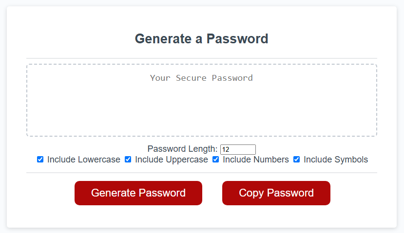

# Password Generator

### Description

Reusing a similar password for every application will pose a huge risk to your online data if leaked. This application was made to generate a random password with selected criteria by the user. Utilising basic HTML, CSS and Javascript this project can be run inbrowser, with the simple yet polished, responsive interface for a multitude of screen sizes.

## Table of Contents

- [Built With](#built-with)
- [Installation](#installation)
- [Usage](#usage)
- [Credits](#credits)

## Built With
- HTML
- CSS
- Javascript ES6+

## Installation

Below is an example of how you can clone the project onto your own device:
1. Clone the repository within a new terminal
    ```md
        git clone https://github.com/squrpe/Password-Generator.git
    ```

## Usage

To access the project's application follow this link https://squrpe.github.io/Password-Generator/ or open within your chosen IDE or browser

Below is what the application looks like:



To generate a new password, click the generate password button and follow the prompts on the screen. However, follow the minimum criteria of having at least one usable character and inputing a length between 8 and 129.

## Credits

Base Code & Project Idea: The University of Adelaide Coding Bootcamp

---

## Contact

Lara Nicole - [grockelara@gmail.com](grockelara@gmail.com)

Project Link - https://github.com/squrpe/Password-Generator

Project Deployment - https://squrpe.github.io/Password-Generator/
