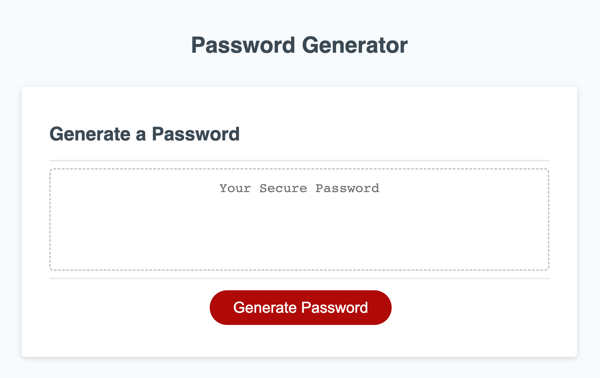

# Password Generator
---

## Description

Online safety is a major concern in this generation, and reusing a similar or the same password for everything will pose a huge risk to your online data if leaked. Thus, this application was made to generate a random password by selected criteria made by the user. It's run inbrowser, with a clean and polished, responsive interface for a multitude of screen sizes. The starter code was sourced [elsewhere](#credits) and the JavaScript was refined to prompt the user and generate a randomised password. This project allows one to practice vanilla JavaScript functions and proper syntax. 

## Table of Contents

- [Installation](#installation)
- [Usage](#usage)
- [Credits](#credits)

## Installation

Below is an example of how you can download the project onto your own device:

1. Open your devices terminal application
2. Locate to the correct file destination that you are wanting to download this project to
3. Clone the repository using this link: 
    ```md
        git clone https://github.com/squrpe/bootcamp-week3challenge.git
    ```
4. You may get prompted to input you github details, thus do so. Otherwise, the project will now be succesfully installed onto your device.

This project contains:
- HTML
- CSS
- Vanilla Javascript

To open and access this project on your personal device, you can download an IDE of your choice but we recommend Visual Studio Code.

After downloading the IDE of your choice you will have access to the raw code. However to host the webpage locally, you will need to download an extension that allows you to open it into your default browser or in your IDE. I recommend Liveserver:


Then using this type of extension, right clicking the file and pressing "Open with Live Server" allows you to open the webpage in your default browser and check out the project from your own device.

## Usage

To access the project's application follow this link: https://squrpe.github.io/bootcamp-week3challenge/

Below is what the application looks like:



To generate a new password, click the generate password button and follow the prompts on the screen. However, follow the minimum criteria of having at least one usable character (for example, lowercase) and inputing a length between 8 and 129, otherwise there will be no generation. 

## Credits

HTML and CSS code: https://adelaide.bootcampcontent.com/the-university-of-adelaide/UADEL-VIRT-FSF-PT-08-2022-U-LOLC

---

## Contact

Lara Grocke - [@my_twitter](twitter.com) - [myemail@email.com](gmail.com)

Project Link - https://github.com/squrpe/bootcamp-week3challenge

Project Deployment - https://squrpe.github.io/bootcamp-week3challenge/
